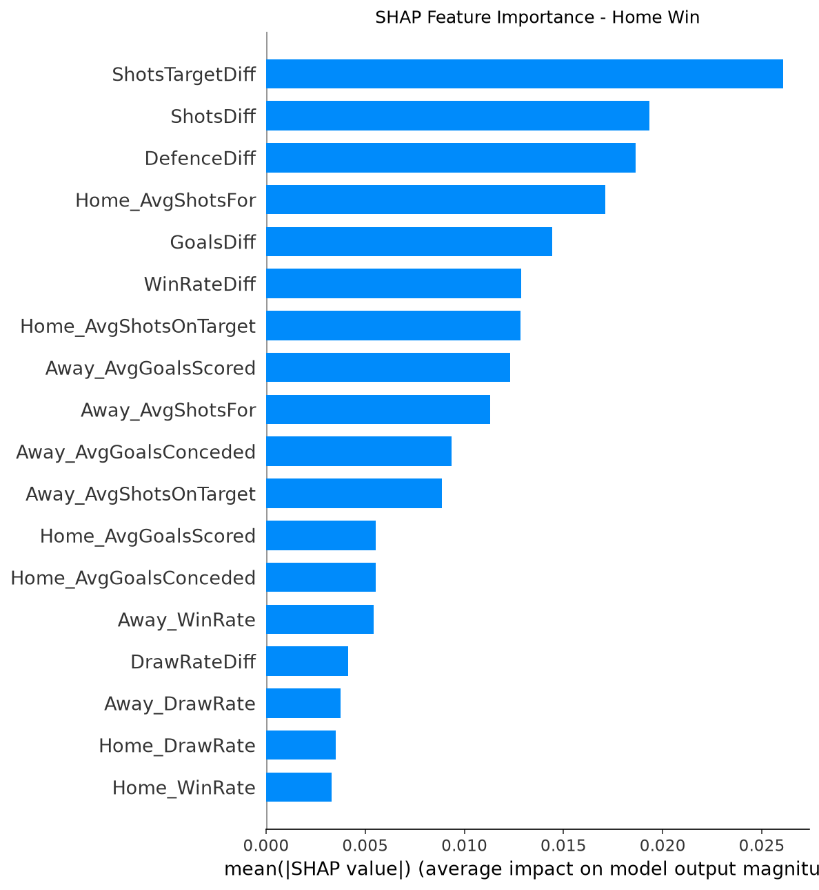

# EPL Match Outcome Analysis & Prediction (2018–2023)
 
A complete end-to-end data science project analysing 5 seasons of English Premier League data to uncover performance trends and predict match outcomes using machine learning - structured as a formal ML experiment with rolling form features, multi-model comparison, cross-validation, and SHAP explainability.
 

 
---
 
## Project Overview
 
This project covers the full data science pipeline from raw data collection to an interactive Power BI dashboard using real EPL match data from 2018 to 2023.
 
- **5 seasons** of EPL data (2018-19 to 2022-23)
- **1,900+ matches** analysed
- **Pre-match prediction** using rolling form features from each team's last 5 games - no post-match stats used
- **3 models compared** - Logistic Regression, Random Forest, XGBoost - evaluated with stratified k-fold cross-validation
- **SHAP analysis** identifying which features drive predictions
- **Interactive Power BI dashboard** with KPI cards, slicers, and conditional formatting
---
 
## Tools & Technologies
 
- **Python** — Pandas, NumPy, Matplotlib, Seaborn, scikit-learn, XGBoost, SHAP
- **Jupyter Notebook** - analysis and modelling environment
- **Power BI Desktop** - interactive dashboard
- **Data source** - [football-data.co.uk](https://www.football-data.co.uk/englandm.php) (free, no login required)
---
 
## Project Structure
 
```
epl-match-analysis/
├── load_data.ipynb            ← load and merge 5 seasons of data
├── eda.ipynb                  ← data cleaning, EDA, and visualizations
├── model.ipynb                ← baseline logistic regression model
├── advanced_model.ipynb       ← rolling features, model comparison, SHAP
├── outputs/
│   ├── result_distribution.png
│   ├── goals_by_season.png
│   ├── shots_vs_goals.png
│   ├── confusion_matrix.png
│   ├── shap_importance.png
│   └── epl_clean_with_predictions.csv
├── EPL_Dashboard.pbix         ← Power BI dashboard file
├── requirements.txt
└── README.md
```
 
---
 
## Data Setup
 
The raw data files are not included in this repository. To download them:
 
1. Go to [football-data.co.uk/englandm.php](https://www.football-data.co.uk/englandm.php)
2. Download the CSV files for seasons: 2018-19, 2019-20, 2020-21, 2021-22, 2022-23
3. Save them into the `data/` folder
4. Rename them as:
   - `season-1819.csv`
   - `season-1920.csv`
   - `season-2021.csv`
   - `season-2122.csv`
   - `season-2223.csv`
---
 
## How to Run
 
**1. Clone the repository**
```bash
git clone https://github.com/rajdeepgupta68/epl-match-analysis.git
cd epl-match-analysis
```
 
**2. Install dependencies**
```bash
pip install -r requirements.txt
```
 
**3. Launch Jupyter**
```bash
jupyter notebook
```
 
**4. Run the notebooks in order**
- `load_data.ipynb` → loads and merges all seasons
- `eda.ipynb` → cleans data and generates visualizations
- `model.ipynb` → baseline model with post-match features
- `advanced_model.ipynb` → rolling features, model comparison, SHAP analysis
**5. Open the dashboard**
- Open `EPL_Dashboard.pbix` in Power BI Desktop
- Data is pre-connected to `outputs/epl_clean_with_predictions.csv`
---
 
## Key Findings
 
- **Home advantage is real** - home teams win 44% of matches vs 33% for away teams, consistent across all 5 seasons
- **Man City dominated** home fixtures with 78 home wins across 5 seasons, followed by Liverpool (73)
- **Shots on target differential** is the single strongest predictor of match outcome, confirmed by both model performance and SHAP analysis
- **Draws are the hardest outcome to predict** - draw rate features ranked lowest in SHAP importance, explaining why all models struggle with this class — a known challenge across football analytics
---
 
## ML Experiment
 
Rather than training a single model, this project frames prediction as a structured experiment:
 
### Feature Engineering
Instead of using post-match stats, rolling averages over each team's **last 5 games** were computed before each match:
- Average goals scored and conceded
- Average shots and shots on target
- Win rate and draw rate
- Differential features between home and away team
### Model Comparison (Stratified 5-Fold Cross-Validation)
 
| Model | Mean Accuracy | Std Dev |
|---|---|---|
| Logistic Regression | 47.32% | 3.82% |
| XGBoost | 48.80% | 1.38% |
| **Random Forest** | **49.39%** | **1.88%** |
 
Random Forest was selected as the best model based on accuracy and consistency across folds.
 
### Final Model Evaluation (Random Forest)
 
| Metric | Score |
|---|---|
| Accuracy | 47.48% |
| Log Loss | 1.0364 |
| Home Win F1 | 0.58 |
| Away Win F1 | 0.49 |
| Draw F1 | 0.12 |
 
Accuracy is lower than the baseline model because this uses only **pre-match features** - no information from the match itself. Predicting football outcomes from form alone is genuinely hard; professional models rarely exceed 55% on a 3-class problem.
 
### SHAP Feature Importance
 

 
SHAP analysis reveals that **shots on target differential, shots differential, and defensive form** are the top drivers of home win predictions — while draw rate features have minimal impact, explaining the model's difficulty predicting draws.
 
---
 
## Power BI Dashboard
 
The dashboard includes:
- **KPI cards** — total matches, avg home goals, avg away goals
- **Pie chart** — match outcome distribution
- **Line chart** — average goals per season trend
- **Bar chart** — home wins by team (ranked)
- **Table** — predicted vs actual results with conditional formatting
- **Slicers** — filter by season and home team
---
 
## Potential Future Improvements
 
- **Streamlit deployment** — build a web app where users select two teams and get a pre-match prediction with probability scores
- **Player-level features** — incorporate squad strength, injuries, and suspensions
- **Betting odds as features** — market odds are strong pre-match predictors
- **Expanded dataset** — include more seasons or other leagues to increase training data
- **Head-to-head records** — historical matchup results as an additional feature
---
 
## Requirements
 
```
pandas
numpy
matplotlib
seaborn
scikit-learn
xgboost
shap
jupyter
openpyxl
```
 
---
 
## Author
 
Built as a portfolio data science project covering data collection, exploratory analysis, machine learning experimentation, and business intelligence visualisation. Man United fan here btw.
