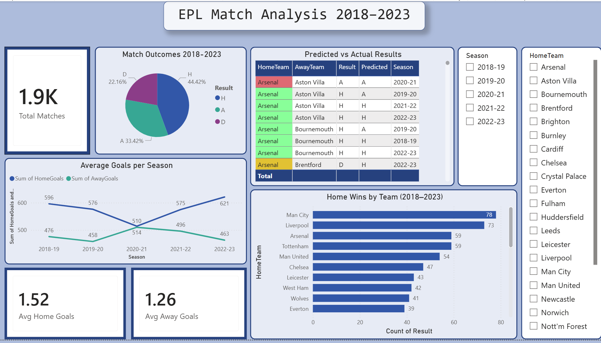

# EPL Match Outcome Analysis & Prediction (2018–2023)

A complete end-to-end data science project analysing 5 seasons of English Premier League data to uncover performance trends and predict match outcomes using machine learning.



---

## Project Overview

This project covers the full data science pipeline — from raw data collection to an interactive Power BI dashboard — using real EPL match data from 2018 to 2023.

- **5 seasons** of EPL data (2018-19 to 2022-23)
- **1,900+ matches** analysed
- **Logistic Regression** model predicting Home Win / Draw / Away Win
- **Interactive Power BI dashboard** with KPI cards, slicers, and conditional formatting

---

## Tools & Technologies

- **Python** — Pandas, NumPy, Matplotlib, Seaborn, scikit-learn
- **Jupyter Notebook** — analysis and modelling environment
- **Power BI Desktop** — interactive dashboard
- **Data source** — [football-data.co.uk](https://www.football-data.co.uk/englandm.php) (free, no login required)

---

## Project Structure

```
epl-match-analysis/
├── data/                        ← raw CSV files (see Data Setup below)
├── notebooks/
│   ├── 01_load_data.ipynb       ← load and merge 5 seasons of data
│   ├── 02_eda.ipynb             ← data cleaning, EDA, and visualizations
│   └── 03_model.ipynb           ← feature engineering, model training, evaluation
├── outputs/
│   ├── result_distribution.png
│   ├── goals_by_season.png
│   ├── shots_vs_goals.png
│   ├── confusion_matrix.png
│   └── epl_clean_with_predictions.csv
├── EPL_Dashboard.pbix           ← Power BI dashboard file
├── requirements.txt
└── README.md
```

---

## Data Setup

The raw data files are not included in this repository. To download them:

1. Go to [football-data.co.uk/englandm.php](https://www.football-data.co.uk/englandm.php)
2. Download the CSV files for seasons: 2018-19, 2019-20, 2020-21, 2021-22, 2022-23
3. Save them into the `data/` folder
4. Rename them as:
   - `season-1819.csv`
   - `season-1920.csv`
   - `season-2021.csv`
   - `season-2122.csv`
   - `season-2223.csv`

---

## How to Run

**1. Clone the repository**
```bash
git clone https://github.com/YOUR_USERNAME/epl-match-analysis.git
cd epl-match-analysis
```

**2. Install dependencies**
```bash
pip install -r requirements.txt
```

**3. Launch Jupyter**
```bash
jupyter notebook
```

**4. Run the notebooks in order**
- `01_load_data.ipynb` → loads and merges all seasons
- `02_eda.ipynb` → cleans data and generates visualizations
- `03_model.ipynb` → trains the model and exports predictions

**5. Open the dashboard**
- Open `EPL_Dashboard.pbix` in Power BI Desktop
- Data is pre-connected to `outputs/epl_clean_with_predictions.csv`

---

## Key Findings

- **Home advantage is real** — home teams win 44% of matches vs 33% for away teams
- **Man City dominated** home fixtures with 78 home wins across 5 seasons, followed by Liverpool (73)
- **Shots on target** is the strongest predictor of match outcome
- **Draws are the hardest** outcome to predict — a known challenge across football analytics

---

## Model Performance

| Metric | Score |
|---|---|
| Model | Logistic Regression |
| Accuracy | 62.63% |
| Best predicted class | Home Win (F1: 0.73) |
| Hardest class | Draw (F1: 0.06) |

The model performs well on Home Wins and Away Wins but struggles with Draws — which is consistent with findings across the football analytics industry.

---

## Power BI Dashboard

The dashboard includes:
- **KPI cards** — total matches, avg home goals, avg away goals
- **Pie chart** — match outcome distribution
- **Line chart** — average goals per season trend
- **Bar chart** — home wins by team (ranked)
- **Table** — predicted vs actual results with conditional formatting
- **Slicers** — filter by season and home team

---

## Potential Future Improvements

- **Improve Draw prediction** — class imbalance handling, ensemble models (Random Forest, XGBoost)
- **Pre-match prediction** — replace post-match stats with rolling averages (last 5 games) so the model can predict outcomes before kick-off
- **Player-level features** — incorporate squad strength, injuries, and suspensions
- **Betting odds as features** — market odds are strong predictors of match outcomes
- **Deploy as a web app** — build a simple Streamlit app where users input two teams and get a predicted outcome

---

## Author

Built as a portfolio data science project covering data collection, exploratory analysis, machine learning, and business intelligence visualisation.
